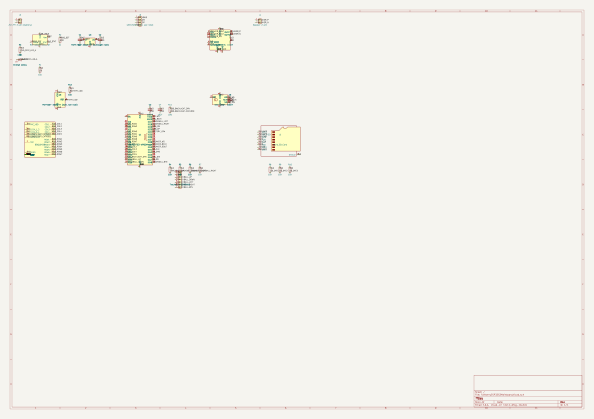

# Standalone smart keyboard: ESP32-S3 + trackball + voice notes

This supersedes the direction in [Hardware_ESP32_Trackball_Mainboard.md](Hardware_ESP32_Trackball_Mainboard.md) for a bigger pivot: instead of a host-powered accessory, this is a standalone, battery-powered device with its own enclosure that **pairs wirelessly** with the Xteink X4 (or another BLE HID host) rather than physically attaching to it. It keeps the BBQ10 keyboard and the ICSH044A trackball from that earlier doc, and adds a microphone, speaker, microSD storage, a LiPo battery, and Wi-Fi-based voice transcription via the OpenAI Whisper API.

**Status: architecture + firmware, not a fabricated/tested board**, same caveat as the trackball doc before it. Nothing here has touched real hardware. The pin table especially should be treated as a reasoned starting point, not a verified-correct final assignment -- see the note in that section.

## Why ESP32-S3 (changed from the trackball doc's classic ESP32)

The trackball-only doc deliberately stayed on classic ESP32 to avoid an unnecessary chip port. That reasoning doesn't hold anymore:

- **GPIO budget**: mic + speaker (I2S) + SD (SPI) + battery monitoring pushes pin count well past what's comfortable on classic ESP32, especially once the trackball's 4 direction lines are added back in. S3 has significantly more usable GPIO.
- **No more input-only-pin problem**: classic ESP32's GPIO 34/35/36/39 have no internal pull-up/down hardware, which is why the trackball doc needed external pull-up resistors and a workaround pin assignment. S3's GPIO 0-21 are all normal bidirectional pins with full pull capability, which simplifies the trackball wiring too.
- **RAM/PSRAM**: buffering audio for WAV writes and HTTPS JSON responses at the same time wants more RAM than classic ESP32 has to spare. This board specs the ESP32-S3-WROOM-1-N16R8 SKU (8MB octal PSRAM) for that headroom -- see the Pin plan section for the GPIO tradeoff that choice costs.
- **This is also just the chip the earlier "smart ML keyboard" conversation was pointing at** (TFLite Micro / vector instructions for things like trackball gesture recognition), so this consolidates onto one chip instead of maintaining two board types for related features.

This does mean re-deriving parts of the firmware that assumed classic ESP32 (see Firmware section) rather than reusing the trackball board type's `BOARD_TYPE == ESP32` code paths directly.

## Power: LiPo battery, not host-powered

This is a real change of philosophy from the rest of this repo (the USB/Arduino board types are explicitly host-powered with no battery). Get this part right -- LiPo mishandling is a fire risk, not just a design nitpick:

- **Use a protected cell.** A LiPo pouch cell with a built-in protection PCB (over-charge/over-discharge/over-current cutoff) is non-negotiable, not a nice-to-have.
- **Charge IC**: a standard linear charger like the MCP73831 (single-cell, sets charge current via one resistor, JST-PH battery connector) is the well-trodden, low-risk choice here -- it's what the overwhelming majority of small LiPo hobby projects use. Add its STAT pin straight to an LED + resistor for a charge-status indicator; that doesn't need to cost an MCU pin.
- **Fuel gauge (recommended)**: a coulomb-counting gauge like the MAX17048 gives an actual battery-percentage reading over I2C instead of a rough voltage-divider guess, and it's cheap. If skipping it to save cost/pins, fall back to a simple ADC voltage divider on the battery line (~2:1 divider into an ADC-capable GPIO, with the usual caveat that LiPo voltage-to-charge-% curves are nonlinear and this reading will be a rough estimate at best, especially under load).
- **Load switch / deep sleep**: route mic, speaker amp, and SD card power through a MOSFET load switch gated by the MCU, so they can be fully powered down (not just idled) between uses -- this is where the actual battery-life win comes from, more than any peripheral-level low-power mode.
- **Cell size**: pick based on the enclosure size once that's designed; a 500-1000mAh pouch cell is a reasonable starting range for a pocket-sized device with WiFi used briefly once or twice a day, not continuously.

## New peripherals

| Peripheral | Suggested part | Interface |
|---|---|---|
| Microphone | ICS-43434 (I2S MEMS mic; same category of part as the INMP441 this doc originally specified, switched to one with a real KiCad symbol available) | I2S, digital output avoids analog noise pickup |
| Speaker amp | MAX98357A (I2S Class-D amp) + small 8Ω speaker | I2S |
| Storage | microSD (SDMMC 1-bit mode, not SPI -- see Pin plan below for why) | SDMMC |
| Fuel gauge | Not included in this revision -- no spare pin for it, see the Pin plan's battery-monitoring note | -- |
| Charger | MCP73831 | Standalone, JST-PH battery connector |

## Pin plan

*Full schematic (30 components, 44 verified nets) — see [`KiCad/FairberryESP32S3Mainboard/`](../KiCad/FairberryESP32S3Mainboard) for the source `.kicad_sch`, the generator scripts that build it, and how to regenerate/re-verify it with `kicad-cli`. Schematic only — no PCB layout yet.*

**Corrected and verified against the real ESP32-S3-WROOM-1 KiCad symbol** (`RF_Module:ESP32-S3-WROOM-1`, used in [`KiCad/FairberryESP32S3Mainboard/`](../KiCad/FairberryESP32S3Mainboard)), not against a guess about which GPIOs a generic "ESP32-S3 module" exposes. An earlier version of this table assumed GPIO22-25 and GPIO33-34 were available (true on the classic ESP32, not true on this module -- they're used internally for flash/PSRAM and aren't brought out to pins at all). The module exposes **GPIO 0-21 and 35-48 as general IO, plus separately-named RXD0/TXD0 pins (this module's real UART0, electrically GPIO44/43)** -- 34 general IO pins, 28 usable after excluding strapping pins (0/3/45/46) and reserving 19/20 for native USB.

**Module SKU: ESP32-S3-WROOM-1-N16R8** (16MB flash, 8MB octal PSRAM), picked for headroom on audio buffers, the web dashboard, and WiFi/TLS rather than leaving RAM unspecified. This has one real consequence for the pin table below: on any *octal*-PSRAM WROOM-1 SKU (`R8`/`R16V`), GPIO35/36/37 are wired internally to the in-package PSRAM and cannot be used as GPIO -- they simply don't work as signal pins on this SKU, even though the generic schematic symbol still draws them as ordinary pins. (A cheaper quad-PSRAM SKU like `-N16R2`, 2MB PSRAM, wouldn't have this restriction and would need no pin changes -- it's a real tradeoff, not a strictly-better option.) Mic I2S is moved off GPIO35-37 onto GPIO43/44 (the RXD0/TXD0 pins, i.e. UART0) and GPIO46 as a result -- see below.

28 pins needed, 28 available -- **this fits with zero spare margin**, which forced three real design changes from the original plan:

- **SD moved from 4-pin SPI to 3-pin SDMMC** (the ESP32-S3's native 1-bit SDMMC peripheral -- `storage.h` uses `SD_MMC.h`, not `SD.h`+`SPI.h`).
- **RGB trackball LEDs cut from this revision entirely.** There wasn't a pin left for them after fixing the GPIO22-25/33-34 mistake. `TRACKBALL_LED_ENABLED` isn't wired up for this board type -- a future revision would need an I2C GPIO expander or a module with more exposed GPIO.
- **Mic I2S moved onto UART0 + one strapping pin** (see the SKU note above), which means the serial console/flashing path for this board is native USB (GPIO19/20), not UART0 -- set `ARDUINO_USB_CDC_ON_BOOT=1` (or the ESP-IDF equivalent) rather than relying on RXD0/TXD0 for `Serial`.

| Function | Pins | Notes |
|---|---|---|
| Keyboard rows (7) | 1,2,4,5,6,7,8 | |
| Keyboard cols (5) | 9,10,11,12,13 | |
| Keyboard backlight | 14 | |
| Trackball UP/DOWN/LEFT/RIGHT | 15,16,17,18 | All normal GPIOs on S3 -- internal pull-ups usable, but keep external pull-ups too per the trackball doc's polarity caveat |
| Trackball BTN | 48 | Not RTC-capable, so it can't double as a deep-sleep wake source the way an earlier draft of this table assumed -- see boards.h. Deep-sleep wake is open follow-up work. |
| Battery low-battery flag | 21 | **Digital flag, not an ADC voltage reading** -- every ADC-capable pin (GPIO1-10 and 11-20) is otherwise committed by the time the keyboard matrix, trackball, and USB reservation are accounted for. A real capability reduction from "know the battery percentage": see boards.h's `BATTERY_LOW_PIN` comment for the reasoning and the upgrade path (an I2C fuel gauge, which doesn't need an ADC-capable pin, but does need a pin this board doesn't currently have spare). |
| Mic I2S (WS/BCLK/DIN) | 43,44,46 | GPIO43/44 are the module's UART0 pins (RXD0/TXD0), free because this board's console runs over native USB instead. GPIO46 is a strapping pin, safe here because MIC_DIN is an input and the mic's output doesn't drive it during a bootloader-mode reset. **Not GPIO35-37** -- those are unusable on the -N16R8 (octal PSRAM) SKU this board specs, see above. |
| Speaker I2S (WS/BCLK/DOUT) | 38,39,40 | Separate I2S port from the mic rather than a shared-clock setup, simpler to get right |
| SD SDMMC (CLK/CMD/D0) | 41,42,47 | 1-bit mode |

No spare pins remain for anything not already listed here -- a status LED, a dedicated power button, a fuel gauge, anything else would need to displace something above rather than just being added.

If you're hand-wiring a prototype rather than using the KiCad board, get the mic+speaker+SD+keyboard+trackball working incrementally on a breadboard, same as any board bring-up.

## Firmware

New modules, all opt-in and independent of the existing keyboard/trackball code paths:

- `BBQ10/storage.h` -- SD card init and file helpers.
- `BBQ10/audio.h` -- I2S mic capture to WAV on SD, I2S speaker playback, confirmation tones.
- `BBQ10/whisper_sync.h` -- Wi-Fi connection, SNTP time, scanning SD for un-transcribed recordings, uploading to the OpenAI Whisper API, writing the resulting `.txt` next to the `.wav`. Manual trigger (a key combo) and a once-daily scheduled sync.

Enabled via `WIFI_TRANSCRIPTION_ENABLED` in `configuration.h`. WiFi credentials and the OpenAI API key live in `BBQ10/secrets.h`, which is gitignored -- copy `BBQ10/secrets.h.example` and fill in your own values, never commit real credentials.

Required additional Arduino library: **ArduinoJson** (for parsing the Whisper API response), on top of the libraries already listed in [Hardware_Fairberry_Mainboard.md](Hardware_Fairberry_Mainboard.md).

### What this does and doesn't do

- Records audio locally to SD as WAV. This part works fully offline.
- Playback of stored recordings and short confirmation tones, also fully offline.
- Transcription requires Wi-Fi and an OpenAI API key, and happens only when a sync runs (manual trigger or once daily) -- it is not real-time, and it depends on an external paid API. Recordings made with no Wi-Fi in range just wait on the SD card until the next successful sync.
- There's no on-device speech recognition of any kind here -- see the earlier conversation in this repo's history for why (a real ASR model doesn't fit in a microcontroller's RAM budget). If you want offline transcription, that's a fundamentally different, much heavier approach (e.g. relaying audio to a more powerful paired host), not something this firmware attempts.

### Local transfer mode (no cloud)

Separate from Whisper sync, `TRANSFER_MODE_ENABLED` adds a local-only web dashboard for browsing and downloading recordings/transcripts over the LAN -- no OpenAI account needed for this one, just WiFi credentials. Toggle with **SYM + T**. `BBQ10/web_server.h` runs a plain HTTP server (`WebServer.h`, built into the ESP32 Arduino core, no extra library needed) listing `/recordings`, with download/stream links for each `.wav` and its `.txt` if one exists.

Since this device has no screen, there's no way to display its own IP address -- on activation it instead **types the local URL as keystrokes** into whatever's currently focused on the paired host, the same BLE HID path used for normal typing. Focus a text field on the X4 (or wherever) before toggling transfer mode on if you want to actually capture the URL; otherwise those keystrokes go wherever the host happens to be focused.

Not implemented: tag filtering (there's no tagging mechanism anywhere in this firmware yet -- recordings are just numbered), and HTTP Range requests aren't specifically handled, so audio scrubbing in a browser's `<audio>` player may or may not work depending on how your browser's player handles a non-seekable stream.

If both `WIFI_TRANSCRIPTION_ENABLED` and `TRANSFER_MODE_ENABLED` are on at once: a scheduled Whisper sync checks whether transfer mode is currently active before disconnecting WiFi at the end of its run, so it won't cut off an in-progress browsing session. They otherwise operate independently.

### Voice typing (record, verify by ear, then send)

A third, different mode from the two above: `VOICE_TYPING_ENABLED` gives you an immediate dictate-and-verify loop, closer to a phone's voice-to-text keyboard than to a note-recorder. **SYM + V** starts recording; pressing it again stops and immediately (not batched, not waiting for a daily sync) uploads the clip to Whisper, then sends the returned text to the OpenAI TTS API (`BBQ10/tts.h`, `/v1/audio/speech`) and plays the reply back through the speaker so you can hear whether it transcribed you correctly. After playback, **Enter** confirms and types the text into the host (`BBQ10/keystroke_util.h`'s `typeString()`, the same keystroke path used everywhere else); **Backspace** discards it; a 15-second timeout auto-discards if you walk away.

This is genuinely different from the batch sync -- that one is for a longer recording you're fine waiting on, this one is for a sentence or two you want to send right now, with a chance to catch a bad transcription before it goes out. It reuses `whisperTranscribeToString()` from `whisper_sync.h` (refactored to return text directly rather than only writing to a `.txt` file, so both modes share the same upload code).

**This flow runs blocking, synchronously**, start to finish -- WiFi connect, the Whisper round-trip, the TTS round-trip, playback, and waiting for your confirm keypress all happen with the keyboard/trackball not responding to anything else. Expect a real pause (WiFi connect alone can take several seconds) between stopping the recording and hearing it read back. Making this non-blocking would mean a proper async state machine spanning multiple network round-trips, which is a meaningfully bigger undertaking than this pass -- noted as a known limitation, not attempted here.

Recording for this mode reuses the same underlying `audioStartRecording()`/`audioRecordingActive` state as the batch-record combo (SYM + Backspace) -- `audioStartRecording()` now refuses to start a second recording while one's already active (from either combo), rather than silently corrupting/orphaning whichever one was already running, and both combos play a low failure beep if that happens.

## Key combos on this board (beyond the base keyboard ones in [UX_Shortcuts_and_Apps.md](UX_Shortcuts_and_Apps.md))

| Combo | Action | Requires |
|---|---|---|
| SYM + Backspace | Start/stop voice recording (saved for later batch transcription) | `AUDIO_ENABLED` |
| Hold trackball button 2s+ | Trigger a Whisper sync now | `WIFI_TRANSCRIPTION_ENABLED` |
| SYM + T | Toggle local transfer-mode web dashboard | `TRANSFER_MODE_ENABLED` |
| SYM + V | Start/stop voice typing (immediate transcribe + TTS verify + Enter to send) | `VOICE_TYPING_ENABLED` |
| Enter / Backspace | Confirm / discard, only while voice typing is waiting on you after playback | `VOICE_TYPING_ENABLED` |

## Enclosure

Not designed yet. The brief (screwless snap-fit two-half case, internal alignment pins for the board and buttons, rounded edges) is a reasonable, standard approach for a small battery-powered gadget, but the actual dimensions depend on the final PCB size and battery footprint, which don't exist yet -- there's no board layout to design a case around. This is real follow-up work once the electronics are prototyped on a breadboard/perfboard and a rough size is known, not something to draw blind.
